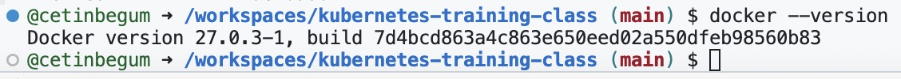

# Docker version check

Docker versiyonunu kontrol etmek için terminal veya komut istemcisinde aşağıdaki komutu kullanabilirsiniz:

```bash
docker --version
```

Bu komut, yüklü olan Docker sürümünü gösterir. Ayrıca, daha ayrıntılı bilgi için şu komutu da kullanabilirsiniz:

```bash
docker version
```

Bu komut, hem istemci hem de sunucu (daemon) sürümleri hakkında daha fazla bilgi verir. Eğer Docker'ı güncellemek veya sorun gidermek istiyorsanız, sürüm bilgisi bu süreçte yararlı olabilir.


